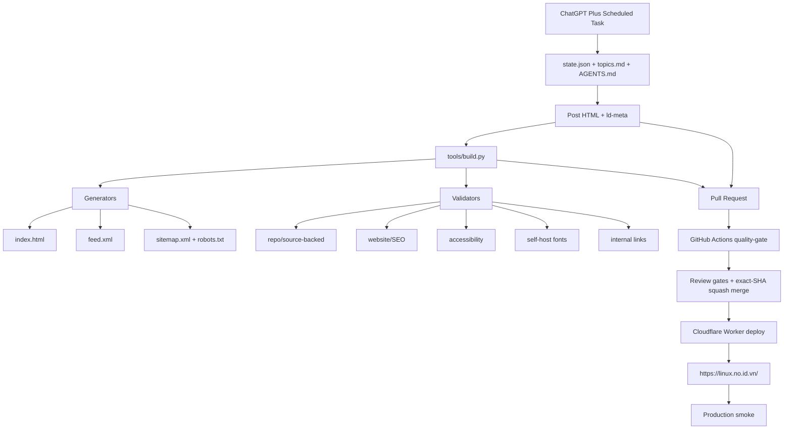

# Linux Daily — Architecture

## Tổng quan

Linux Daily là static-site pipeline. Repository là source of truth; Cloudflare Worker là production serving layer. GitHub Pages không nằm trong đường phục vụ public.



## Source of truth

- `AGENTS.md`: quy tắc vận hành AI.
- `state.json`: cadence state.
- `topics.md`: lịch sử series/chủ đề.
- `site.json`: public origin và site metadata.
- `posts/post-*.html`: nội dung đã xuất bản và `ld-meta`.
- `templates/`: baseline cho homepage và bài mới.
- `assets/`: shared CSS, self-hosted fonts và licenses.

## Build pipeline

`python3 tools/build.py` thực hiện theo thứ tự logic:

1. Render homepage, RSS, sitemap và robots từ source metadata.
2. Normalize historical metadata/accessibility/font loading khi chạy ở write mode.
3. Chạy structural/source-backed validators.
4. Chạy website/SEO, accessibility và self-host-font gates.
5. Chạy deterministic internal-link validation.

`python3 tools/build.py --check` không ghi file; nó fail nếu generated artifact hoặc historical normalization bị stale.

## CI pipeline

`.github/workflows/ci.yml` chạy trên pull request, push `main` và `workflow_dispatch`:

```text
Ruff
  ↓
Pytest
  ↓
publish.py check
  ↓
External link check
  ↓
Cadence smoke
  ↓
Render smoke
```

Production smoke tách khỏi PR quality gate vì production có thể chưa deploy cùng commit trong lúc PR đang review.

Bài hằng ngày đi qua `linux-daily-auto-merge.yml`: kiểm PR/review và exact head SHA trước khi squash-merge, rồi dispatch CI và Production Smoke cho commit sau merge. PR bảo trì được review và squash-merge riêng sau CI. Social output mới đang tạm dừng; asset lịch sử vẫn được giữ.

## Hosting boundary

Public canonical origin là:

```text
https://linux.no.id.vn/
```

Cloudflare Worker chịu trách nhiệm serving/deploy. Repository không dùng `CNAME` và không coi GitHub Pages là production hosting.

## Operational principles

- Không push trực tiếp `main`.
- Không bypass `quality-gate`.
- Generated output phải deterministic.
- Public metadata phải derive từ `site.json` thay vì hard-code nhiều nơi.
- Third-party HTTP instability không được làm local quality gate flaky.
- FreeBSD luôn được review như một OS riêng, không suy diễn Linux semantics.
